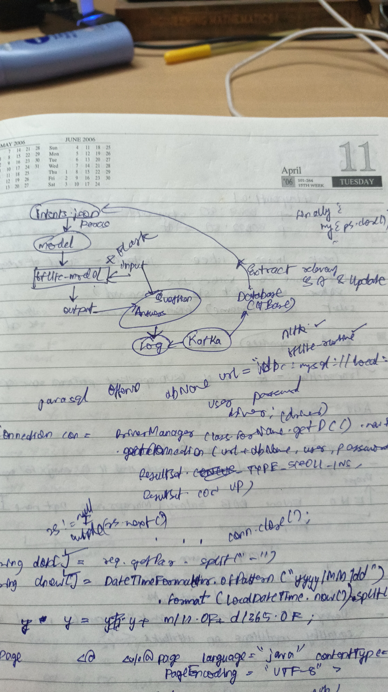

This project is a big data version of my AI Project(Main Repo--->Academics-->AI Project). The questions posed by users to the chatbot and the answers provided by the chatbot form the data. This data may hold some insights. But how do I fetch the data and store the data? At that time, I was fascinated by big data. My mind leaned towards using big data tools such as Apache Cassandra, Kafka and Spark. I built up an idea as follows:

</img>

Basic idea is to stream data into a database and perform analysis to identify relevant questions and answers to be included in the intents.json.

I then decided to implement a part of the idea. I had the app ready in my computer. I had a Linux VM in VirtualBox containing Cassandra, Kafka and Spark. So I decided to connect the app to Kafka, Kafka to Cassandra and Cassandra to Spark.

I first started by first installing Apache Kafka on Windows, then installing an appropriate Java JDK and initializing the environment variables. After successfully starting Kafka on Windows, I could establish connection to Kafka topics through my Flask App(code present in repo) through Kafka-Python library. Since Kafka clusters maybe different nodes(computers) in a network, I thought of sending data to a Kafka cluster on my Virtual Machine. For this I had to change the hosts file on my computer to include the ip address and name of the VM for DNS resolution. Done.

The next step was to connect Kafka to a Cassandra database on my VM. I used DataStax Connector for this purpose. I followed the instructions given in the connector documentation. Done.

Then the next step was to connect Spark to Cassandra. Once again datastax to the rescue. Followed documentation and connected to my database. But the challenge was to make a python program to run spark and connect to database. After a lot of research, I finally succeeded. I ran a python program on thonny IDE to connect a spark session to a database though PySpark and now it was possible to obtain the data in the form of RDD(Resilient Distributed Dataset).

If a developer has to try to follow the same steps to implement the system it would be really difficult for him/her to setup the system and test it. We had Docker as part of our Academics. Infact, we had an assignment on Docker which I have implemented(DockerProject repo). Dockerizing applications saves the hassles of setting up the required dependencies or environment. Hence I decided to dockerize this setup too. 

After a lot of efforts, I produced an image with Kafka and Cassandra(with required database) running and connected to each other. I have pushed this image onto Docker Hub; <b>dockercoolexp/ack-connect</b>. a publicly available image. 

- To pull image: docker pull dockercoolexp/ack-connect:latest
- To run image: docker run --name <container-name> -p 9042:9042 -p 9092:9092 -h="kali" --ip 172.17.0.2 dockercoolexp/ack-connect:latest
- It is neccessary to use the hostname "kali" and ip as mentioned here; if, however a different configuration is required then perform the following steps:
1. Clone this repository.
2. Go to the big-data folder: cd "big data"
3. Modify the kafka, cassandra configuration files as per needs
4. Issue **docker build .**

However the developer must still setup the app on his/her computer, along with the modification of hosts file and must use pyspark to connect to the database.
  
I wanted to demonstrate my work. Hence after some research I hit upon GitPod which basically is an online VM specifically meant to spin up code environments which is perfect for demonstration. I went ahead, created an account and a codespace, setup the code and boom! I finally had a demonstratable code. Now, if a developer wishes to see the code in action he/she just has to:
- Create an account in GitPod
- Click on the below link.
  
  https://gitpod.io/#snapshot/a3cfedc0-4c15-472c-bce8-5c4cf79ea69f
  
  which is basically a snapshot of my work.
  
  and then follow the instructions given in instructions.txt in big data folder.
